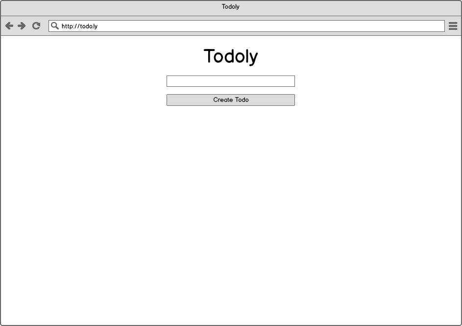
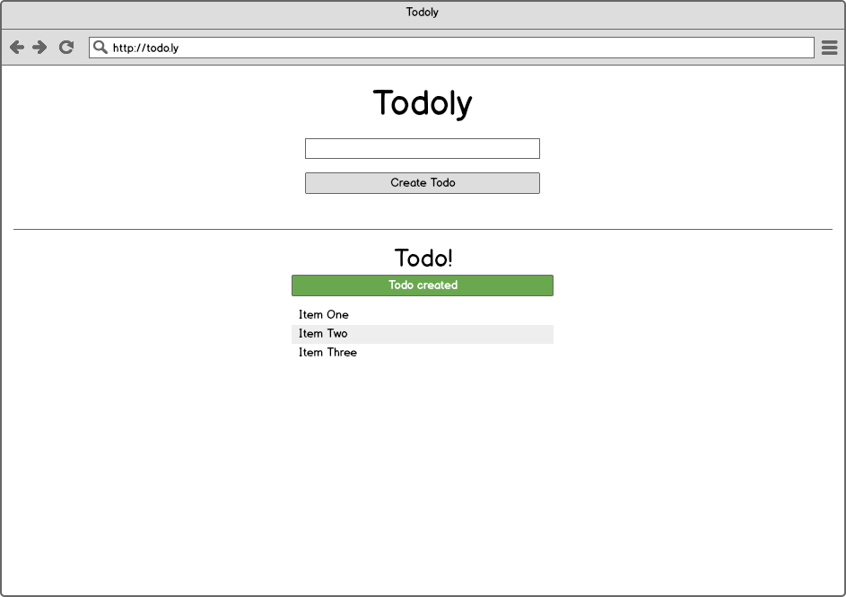
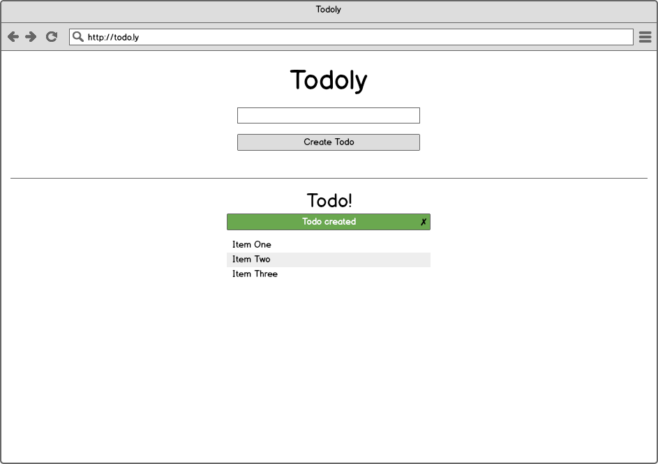
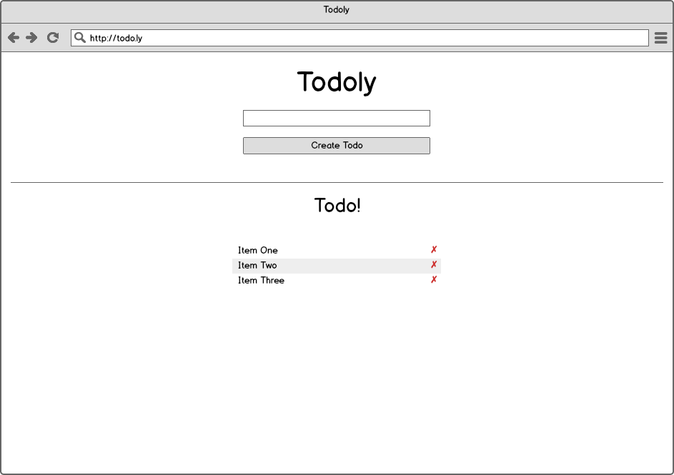
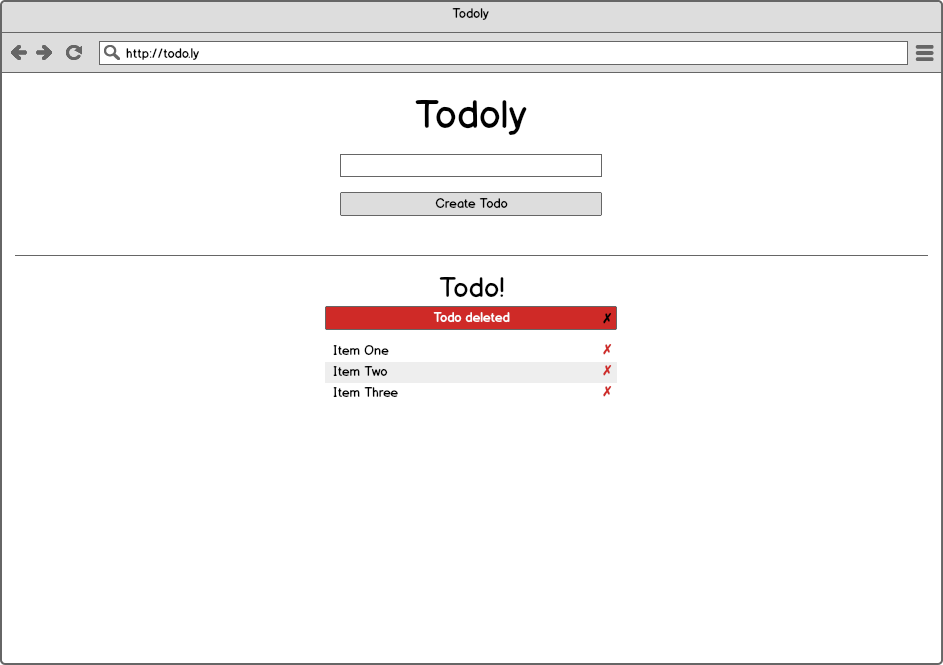
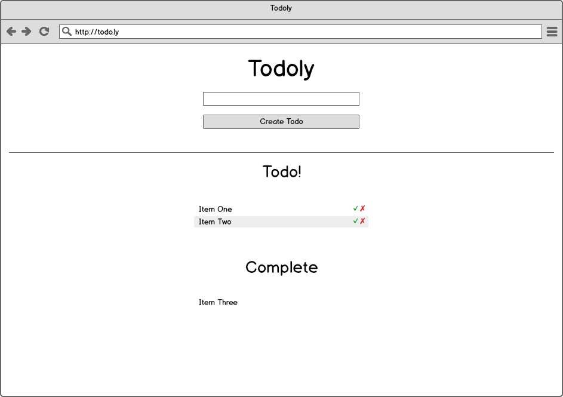
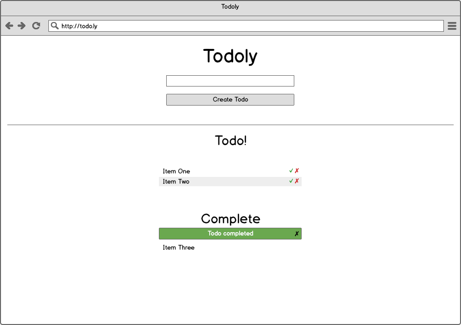

# Todoly

Yes! Finally we have a chance to compete with the hottest web startups; Todo
lists (seriously). To differentiate ourselves from the competition, we've
descided to go with a single page app, since that's clearly the best thing we
can do. Obviously, our customers care more about our technology choices and less
about the actual feature set.

Since we're really awesome developers, we've decided to forego any JavaScript
frameworks and build it all from scratch. You're not allowed to have any
controllers render HTML. JavaScript all the way!

## Stories

### View Homepage
```
As a user
When I navigate to the homepage
Then I see a place type a todo
```



### Create todo (no persistence)
```
As a user
When I type in a todo
And I click "Create Todo"
Then I see that todo below the input
```


### Create todo flash
```
As a user
When I type in a todo
And I click "Create Todo"
Then I see a flash message telling me it's created
And it fades out after 5 seconds
```



### Dismiss create todo flash
```
As a user
Given I have a create todo flash
When I click on the 'x'
Then the flash message is removed
```



### Delete todo (no persistence)
```
As a user
Given I've created a todo
When I click on the 'x' next to the todo
Then the todo is deleted
```



### Delete todo flash
```
As a user
When I type in a todo
And I click "x"
Then I see a flash message telling me it's deleted
And it fades out after 5 seconds
And it's dismissable
```



### Complete todo (no persistence)
```
As a user
Given I've created a todo
When I click on '✓'
Then the todo is removed from the initial list
And I see it in the 'Completed' section
```



### Complete todo flash
```
As a user
When I type in a todo
And I click '✓'
Then I see a flash message telling me it's created
And it fades out after 5 seconds
And it's dismissible
```



### Delete completed todo (no persistence)
```
As a user
Given I've created a todo
And I've completed the todo
When I click the 'x' next to the todo
Then the todo is removed
```

### Completed section disappears
```
As a user
Given I have only one completed todo
When I delete that todo
Then I no longer see the 'Completed' section
```

### Move completed todo back into todos
```
As a user
Given I've created a todo
And I've completed the todo
When I click the 'undo' next to the todo
Then the todo is back in the "Todo" section
```

### Persist all actions
```
As a user
Given I've done a lot of things
When I refresh the page
Then the state of my todo list is persisted
```

## Hints

* [EJS gem](https://rubygems.org/gems/ejs)
* [Rendering JSON](http://guides.rubyonrails.org/layouts_and_rendering.html#rendering-json)
* [Capybara JavaScript Tests](https://github.com/jnicklas/capybara#drivers)
